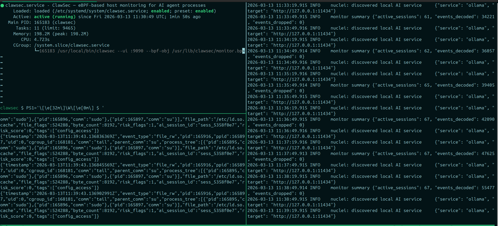
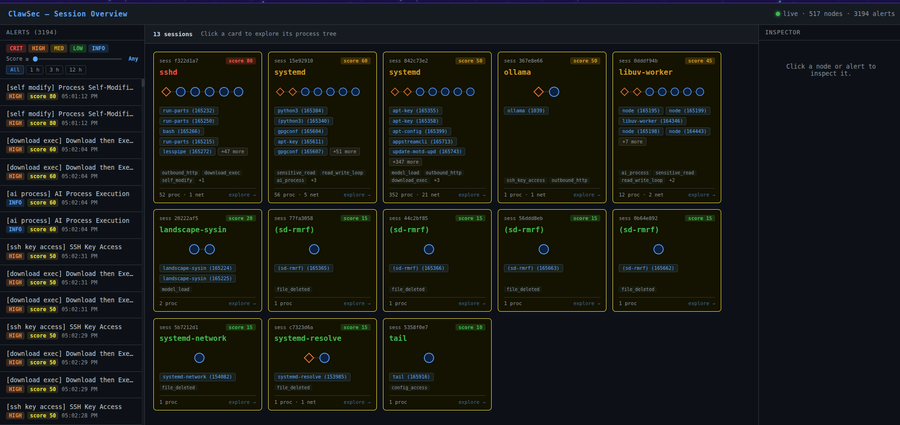
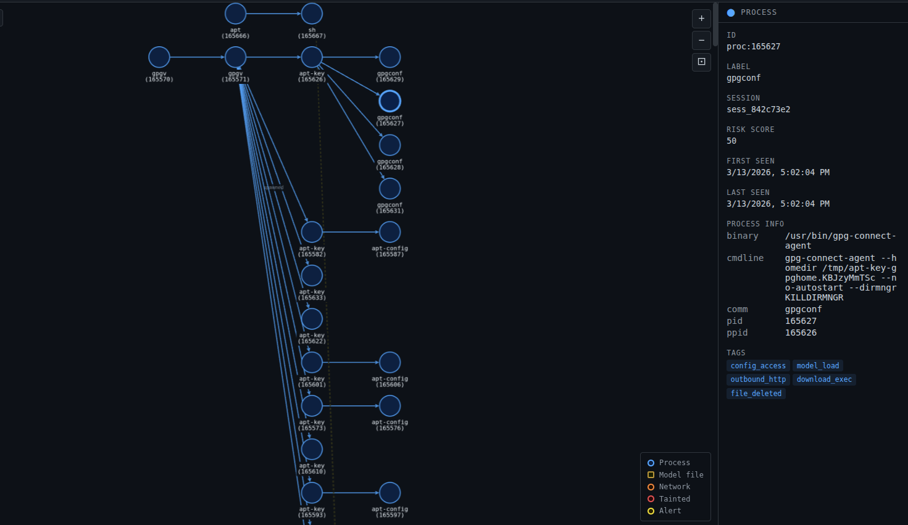

# Onyx

**Kernel-level behavioral monitoring and active vulnerability scanning for AI/ML workloads on Linux.**

Combines two complementary detection engines:

1. **Behavioral detector** — eBPF-based passive monitoring of syscalls, network events, and file operations matched against YAML rules (our engine, Nuclei-inspired)
2. **Nuclei active scanner** — fires automatically against local AI service endpoints when they're detected, finding real vulnerabilities like unauthenticated vector DB access

### What's in this repo

- **eBPF kernel programs** — Tracepoints for exec, file, network, and mmap events (CO-RE, BTF)
- **Behavioral detection engine** — YAML template rules (Nuclei-inspired) for process, file, network, and session patterns
- **Nuclei v3 integration** — Active scanning of local AI services (Qdrant, ChromaDB, Ollama, vLLM, etc.) when connections are observed
- **Session correlation** — Process tree and session IDs for grouping events
- **Output** — NDJSON, grouped JSON, or live SSE stream
- **Detection templates** — Shipped in **[onyx-templates](https://github.com/ClawGuard-Labs/onyx-templates)** (`behavioral-templates/`, `nuclei-templates/`)
- **React dashboard** (optional) — Graph view and alert panel served by the monitor

---

## Table of contents

- [Architecture](#architecture)
- [Requirements](#requirements)
- [Quick Start](#quick-start)
- [Build Targets](#build-targets)
- [Output Format](#output-format)
- [Testing](#testing)
- [Detection templates (onyx-templates)](#detection-templates-onyx-templates)
- [Running as a Background Service (systemd)](#running-as-a-background-service-systemd)
- [SSE Live Stream](#sse-live-stream)
- [Project Structure](#project-structure)
- [Dependencies](#dependencies)
- [Contributing](#contributing)
- [License](#license)
- [Security](#security)

## Architecture

```
┌────────────────────────────────────────────────────────────────┐
│  Kernel (eBPF tracepoints — stable ABI, CO-RE, kernel ≥ 5.15)  │
│  execve │ openat │ read/write │ unlinkat │ mmap │ connect │ …  │
└─────────────────────────┬──────────────────────────────────────┘
                          │  ring buffer (8 MB)
┌─────────────────────────▼──────────────────────────────────────┐
│  consumer   → decode raw bytes      → EnrichedEvent            │
│  correlator → assign session ID     → process tree + timing    │
│  detector   → YAML template rules   → tags + risk score        │
│      │                                                         │
│      └─ net_connect to localhost AI port?                      │
│              │                                                 │
│              ▼  (async goroutine)                              │
│         Nuclei engine → scan target → nuclei_finding event     │
│                                                                │
│  output → NDJSON / grouped JSON → stdout / file / SSE          │
└────────────────────────────────────────────────────────────────┘
```

### How the two detectors work together

| | Behavioral Detector | Nuclei Scanner |
|---|---|---|
| **Type** | Passive | Active |
| **Input** | eBPF kernel events | HTTP requests to local services |
| **Runs on** | Every event | Only `net_connect` to localhost AI ports |
| **Detects** | Process behavior, file access patterns, cross-event chains | Service misconfigs, unauth access, exposed APIs |
| **Output** | Tagged `EnrichedEvent` with risk score | `nuclei_finding` event with matched template |
| **Latency** | Real-time (microseconds) | Async scan (seconds) |

Both detectors fire simultaneously when a connection to a local AI service is observed. The Nuclei scanner does not block the main event loop.

---

## Requirements

- Linux kernel **≥ 5.15** with BTF enabled (`/sys/kernel/btf/vmlinux` must exist)
- Run as **root** (or with `CAP_BPF` + `CAP_PERFMON` + `CAP_NET_ADMIN`)
- **Go 1.22+** for building
- `clang` / `llvm-strip` / `bpftool` for eBPF compilation (only needed for `make bpf`)

---

## Quick Start

YAML detection rules are **not** in this repository. Clone **[onyx-templates](https://github.com/ClawGuard-Labs/onyx-templates)** next to `onyx` (or anywhere you prefer).

```bash
git clone https://github.com/ClawGuard-Labs/onyx
git clone https://github.com/ClawGuard-Labs/onyx-templates
cd onyx
make build
```

**Option A — defaults** — from the `onyx` repo directory, defaults expect **`./onyx-templates/behavioral-templates`** and **`./nuclei-templates`**. Clone the templates repo **into** `onyx` (nested), or symlink:

```bash
git clone https://github.com/ClawGuard-Labs/onyx-templates.git onyx-templates
ln -sfn onyx-templates/nuclei-templates ./nuclei-templates   # optional: default nuclei path
sudo ./bin/monitor
```

If **onyx-templates** sits **next to** `onyx` (sibling), pass paths explicitly:

```bash
sudo ./bin/monitor \
  --behavioral-templates ../onyx-templates/behavioral-templates \
  --nuclei-templates ../onyx-templates/nuclei-templates
```

**More flags:**

```bash
sudo ./bin/monitor \
  --output          events.json \
  --log-level       info \
  --grouped \
  --group-timeout   500ms
```

See [Template bundles (onyx-templates)](#template-bundles-onyx-templates) for installs, authoring, and tests.

---

## Build Targets

```bash
make build          # Compile Go binary + embed eBPF object → bin/monitor
make bpf            # Recompile eBPF C → bpf/monitor.bpf.o  (needs clang)
make gen-vmlinux    # Regenerate vmlinux.h from kernel BTF   (once per kernel)
make run            # Build and run as root
make install        # Install to /usr/local/bin/onyx
make clean          # Remove bin/
```

### Flags

| Flag | Default | Description |
|------|---------|-------------|
| `--bpf-obj <path>` | auto-detect | Path to `monitor.bpf.o`. Auto-detected: `./bpf/`, next to binary, `/usr/lib/onyx/` |
| `--behavioral-templates <dir>` | `./onyx-templates/behavioral-templates` | Directory containing behavioral YAML rules |
| `--nuclei-templates <dir>` | `./nuclei-templates` | Directory containing Nuclei YAML templates for active scanning |
| `--no-nuclei` | false | Disable active Nuclei scanning |
| `--output <file>` | stdout | JSON output file (appended) |
| `--sse <addr>` | disabled | SSE live stream address, e.g. `:8080`. Connect with `curl http://localhost:8080/events` |
| `--grouped` | false | Buffer events by session and flush as one JSON block per session |
| `--group-timeout <dur>` | `500ms` | Idle time before a session group is flushed (only with `--grouped`) |
| `--log-level <level>` | `info` | Log verbosity: `debug` \| `info` \| `warn` \| `error` |
| `--no-tls` | false | Disable TLS uprobe capture (uprobes on `libssl.so`) |
| `--version` | — | Print version and exit |

---

## Output Format

### Flat NDJSON (default)

One JSON line per event:

```json
{"timestamp":"2026-02-21T10:00:01Z","event_type":"exec","pid":12345,"comm":"python3","binary":"/usr/bin/python3","ai_session_id":"sess_a1b2c3d4","risk_score":10,"tags":["ai_process"],"is_ai_process":true}
{"timestamp":"2026-02-21T10:00:02Z","event_type":"net_connect","pid":12345,"comm":"python3","network":{"dst_ip":"127.0.0.1","dst_port":6333,"protocol":"tcp"},"ai_session_id":"sess_a1b2c3d4","risk_score":10,"tags":["outbound_http"]}
{"timestamp":"2026-02-21T10:00:04Z","event_type":"nuclei_finding","pid":12345,"comm":"python3","ai_session_id":"sess_a1b2c3d4","risk_score":70,"tags":["nuclei_finding","qdrant-unauth-access"],"nuclei_result":{"template_id":"qdrant-unauth-access","name":"Qdrant Vector DB Unauthenticated Access","severity":"high","matched_url":"http://127.0.0.1:6333/collections","service":"qdrant"}}
```

### Grouped JSON (`--grouped`)

All events from a session in one block:

```json
{
  "session_id": "sess_a1b2c3d4",
  "parent_comm": "bash",
  "first_seen": "2026-02-21T10:00:01Z",
  "last_seen":  "2026-02-21T10:00:30Z",
  "duration_ms": 29000,
  "peak_risk_score": 80,
  "tags": ["ai_process", "outbound_http", "nuclei_finding", "qdrant-unauth-access"],
  "event_count": 12,
  "events": [ ... ]
}
```

### Risk Score Guide

| Score | Severity | Meaning |
|-------|----------|---------|
| 0–20 | Info | Normal AI activity (process start, model load, HTTP request) |
| 21–50 | Low | Minor concern (config access, file deletion, unusual port) |
| 51–75 | Medium | Elevated risk (download+exec chain, sensitive file access) |
| 76–100 | High | Strong indicator (SSH key access, self-modification) |
| 101+ | Critical | Multiple high-risk patterns in same session |

Nuclei findings add their own score on top of the behavioral score.

---

## Testing

### Test behavioral detection

```bash
# Start monitor
sudo ./bin/monitor --log-level debug --output test.json

# In another terminal — trigger rules:

# ai_process + model_load
python3 -c "open('/tmp/model.pt', 'w').close(); open('/tmp/model.pt')"

# ssh_key_access
cat ~/.ssh/id_rsa 2>/dev/null || echo "no key"

# outbound_http
curl -s https://api.openai.com/v1/models -o /dev/null

# curl_bash_chain (high risk)
bash -c "curl -s http://example.com -o /dev/null"

# Check output
cat test.json | jq '.tags'
```

### Test Nuclei active scanning

```bash
# Start a local Qdrant instance (Docker)
docker run -d -p 6333:6333 qdrant/qdrant

# Start monitor with debug logging
sudo ./bin/monitor --log-level debug --output nuclei_test.json

# Connect something to Qdrant so the monitor sees the port
curl http://localhost:6333/collections

# Within seconds you should see in logs:
# INFO  nuclei: scan triggered  {"target": "http://127.0.0.1:6333", "service": "qdrant"}
# INFO  nuclei finding          {"template_id": "qdrant-unauth-access", "severity": "high"}

# Verify in output
cat nuclei_test.json | jq 'select(.event_type == "nuclei_finding")'
```

### Verify templates load

```bash
# Check behavioral templates load (seen in startup logs)
sudo ./bin/monitor --log-level info 2>&1 | grep "templates loaded"
# Expected: INFO  detection templates loaded  {"count": N, "dir": "./onyx-templates/behavioral-templates"}

# Check Nuclei engine starts
sudo ./bin/monitor --log-level info 2>&1 | grep "nuclei"
# Expected: INFO  nuclei engine ready  {"templates_dir": "./nuclei-templates"}
#           INFO  nuclei active scanner enabled
```

### Full test command

```bash
sudo ./bin/monitor \
  --behavioral-templates ./onyx-templates/behavioral-templates \
  --nuclei-templates ./nuclei-templates \
  --output           events.json \
  --log-level        debug \
  --grouped \
  --group-timeout    500ms
```

---

## Detection templates (onyx-templates)

Rules are maintained in **[onyx-templates](https://github.com/ClawGuard-Labs/onyx-templates)**. Authoring details: [AUTHORING.md](https://github.com/ClawGuard-Labs/onyx-templates/blob/main/AUTHORING.md).

YAML-based rules evaluated against every eBPF event. Rules are loaded at startup — no recompilation required to add or modify them.

| Repository | Role |
|------------|------|
| **[onyx](https://github.com/ClawGuard-Labs/onyx)** (this repo) | eBPF monitor, Go engine, UI |
| **[onyx-templates](https://github.com/ClawGuard-Labs/onyx-templates)** | Behavioral YAML under `behavioral-templates/`, Nuclei YAML under `nuclei-templates/` |

**Local development**

- Clone or symlink so **`./onyx-templates/behavioral-templates`** (and your Nuclei path) exist from the process working directory, **or** pass `--behavioral-templates` / `--nuclei-templates` explicitly (see [Quick Start](#quick-start)).

**`make install`**

- Install copies YAML from **`TEMPLATES_SRC`** (default: `../onyx-templates` relative to the `onyx` tree):

  ```bash
  sudo make install
  # or:
  sudo make install TEMPLATES_SRC=/opt/src/onyx-templates
  ```

- Behavioral rules go to **`/etc/onyx/behavioral-templates/`**; Nuclei rules to **`/etc/onyx/nuclei-templates/`**. The shipped **systemd** unit uses those paths.

**Tests**

- `go test ./...` from `tests/` loads behavioral YAML from **`../../onyx-templates/behavioral-templates`** (sibling of the `onyx` repo). Adjust `tests/helpers_test.go` if your layout differs.

**How Nuclei scanning is triggered**

```
eBPF event: net_connect
  DstIP  = 127.0.0.1
  DstPort = 6333           ← known AI service port (Qdrant)
      │
      ├─→ Behavioral detector runs (all YAML rules)
      │
      └─→ Nuclei scanner (async goroutine):
              http://127.0.0.1:6333  ← scan target
              ↓
              nuclei-templates/ai-services/*.yaml
              ↓
              finding: qdrant-unauth-access (severity: high)
              ↓
              emitted as nuclei_finding event → JSON output
```

**Scanned AI service ports:**

| Port | Service |
|------|---------|
| 6333 | Qdrant |
| 8000 | ChromaDB |
| 8080 | Weaviate |
| 11434 | Ollama |
| 8001 | vLLM |
| 7860 | Gradio |
| 8501 | Streamlit |
| 3000 | LocalAI |
| 19530 | Milvus |
| 9200 | Elasticsearch |

Deduplication: each unique `host:port` is scanned at most once per 10 minutes.

---

## Running as a Background Service (systemd)

The monitor ships with a systemd unit file. Use `make install` to install everything system-wide and `make enable` to start it on boot.

### 1. Build and install

```bash
# Full build (eBPF + React UI + Go binary)
make build

# Install binary, BPF object, templates (from TEMPLATES_SRC), and systemd unit
sudo make install
```

`make install` places files at:

| Path | Contents |
|------|----------|
| `/usr/local/bin/onyx` | Binary |
| `/usr/lib/onyx/monitor.bpf.o` | eBPF object |
| `/etc/onyx/behavioral-templates/` | Behavioral detection rules (from `onyx-templates`) |
| `/etc/onyx/nuclei-templates/` | Nuclei active scan templates (from `onyx-templates`) |
| `/etc/systemd/system/onyx.service` | systemd unit |
| `/etc/logrotate.d/onyx` | Log rotation config |

### 2. Enable and start

```bash
# Enable on boot and start immediately
sudo make enable

# Or manually with systemctl
sudo systemctl enable --now onyx
```

### 3. Check status and logs

```bash
# Service status
sudo systemctl status onyx

# Live logs (journald)
journalctl -u onyx -f

# Output log file (NDJSON events)
tail -f /var/log/onyx/monitor.log
```

### 4. Stop / restart / disable

```bash
sudo systemctl stop    onyx
sudo systemctl restart onyx
sudo systemctl disable onyx   # removes from boot
```

### 5. Uninstall

```bash
# Stops the service, disables it, and removes all installed files
sudo make uninstall

# Logs at /var/log/onyx/ are preserved — remove manually if desired
sudo rm -rf /var/log/onyx/
```

The default `ExecStart` passes the installed template directories and enables the web UI on port 9090:

```
http://localhost:9090    ← live graph dashboard
```
---

## SSE Live Stream

```bash
# Start monitor with SSE
sudo ./bin/monitor --sse :8080

# Stream events in real-time
curl -N http://localhost:8080/events

# Health check
curl http://localhost:8080/healthz
```

---

## Project Structure

```
onyx/
├── bpf/
│   ├── monitor.bpf.c          # eBPF kernel programs (syscall tracepoints)
│   ├── common.h               # Shared kernel/userspace structs and constants
│   ├── vmlinux.h              # BTF-generated kernel headers (CO-RE); see scripts/gen_vmlinux.sh
│   └── monitor.bpf.o          # produced by `make build` (also under bin/ when copied)
├── bin/                       # local build outputs: monitor, monitor.bpf.o (often gitignored)
├── cmd/monitor/
│   └── main.go                # Entry point, flags, config.yaml load, pipeline wiring
├── internal/
│   ├── aiprofile/
│   │   └── config.go          # Loads config.yaml (AI services, processes, model extensions)
│   ├── chagg/                 # Chain aggregation for --compact / --compact-log
│   │   ├── aggregator.go
│   │   ├── types.go
│   │   └── writer.go
│   ├── constants/
│   │   └── helpers.go         # FileExt, IsLocalhost, IsWriteOpen, SeverityScore, …
│   ├── consumer/
│   │   ├── consumer.go        # Ring buffer reader
│   │   └── events.go          # BPF structs, decoder, EnrichedEvent, NucleiResult
│   ├── correlator/
│   │   ├── correlator.go      # PID tracking, session assignment
│   │   └── session.go         # Session state machine
│   ├── detector/
│   │   ├── detector.go        # Behavioral YAML loader + Analyze()
│   │   └── engine.go          # Template evaluation (matcher types)
│   ├── graph/
│   │   ├── graph.go           # In-memory graph + snapshots + SSE subscribers
│   │   └── builder.go         # Applies events + taint to the graph
│   ├── graphapi/              # Dashboard HTTP server (--ui); embeds Vite build
│   │   ├── server.go          # Routes: /api/graph, /api/alerts, /api/chains, /api/services, …
│   │   ├── services.go        # Local AI process + port discovery for the UI bar
│   │   └── static/            # Populated by `make ui` (go:embed)
│   ├── loader/
│   │   └── loader.go          # eBPF load, tracepoints, optional TLS uprobes / LSM
│   ├── nucleiscanner/
│   │   └── scanner.go         # Nuclei v3 wrapper + localhost service probes
│   ├── output/
│   │   └── output.go          # NDJSON, grouped writer, SSE mirror
│   ├── provenance/
│   │   └── tracker.go         # Cross-session file / net_connect taint
│   └── templates/
│       ├── schema.go          # Behavioral template YAML schema
│       └── loader.go          # Walk template dir, parse + compile matchers
├── scripts/
│   ├── onyx.service        # systemd unit (installed to /etc/systemd/system/)
│   ├── logrotate.d/onyx
│   ├── check_deps.sh
│   └── gen_vmlinux.sh
├── tests/                     # `go test ./tests/...`
│   ├── *_test.go
│   └── logs/                  # golden / fixture logs used by some tests
├── ui/                        # Vite + React dashboard source
│   ├── src/                   # App.jsx, GraphView, SessionGrid, AIServicesBar, …
│   ├── index.html
│   ├── vite.config.js
│   └── package.json
├── assets/                    # Screenshots for this README
├── .github/                   # Issue/PR templates
├── config.yaml                # Default AI profile; install copies to /etc/onyx/config.yaml
├── go.mod
├── go.sum
├── Makefile
├── README.md
├── CONTRIBUTING.md
├── CODE_OF_CONDUCT.md
└── LICENSE
```

Behavioral and Nuclei YAML live in the separate **[onyx-templates](https://github.com/ClawGuard-Labs/onyx-templates)** repository.

### Preview

<p align="center">
  <br>
  <em>Realtime logs (onyx running as a systemd service)</em>
</p>

<p align="center">
  <br>
  <em>onyx Dashboard</em>
</p>

<p align="center">
  <br>
  <em>Real-time process graph visualisation</em>
</p>

---

## Dependencies

### Go modules (key)

| Module | Version | Purpose |
|--------|---------|---------|
| `github.com/cilium/ebpf` | v0.16.0 | eBPF program loading and ring buffer |
| `github.com/projectdiscovery/nuclei/v3` | v3.7.0 | Active vulnerability scanning engine |
| `go.uber.org/zap` | v1.27.0 | Structured logging |
| `gopkg.in/yaml.v3` | v3.0.1 | Behavioral template YAML parsing |

### System requirements

| Requirement | Version |
|-------------|---------|
| Linux kernel | ≥ 5.15 with BTF |
| Go toolchain | ≥ 1.22 |
| clang/LLVM | ≥ 14 (for eBPF recompilation only) |
| bpftool | any recent |

---

## Contributing

We welcome contributions! Please read [CONTRIBUTING.md](CONTRIBUTING.md) for development setup, pull request process, and code conventions. By participating, you agree to our [Code of Conduct](CODE_OF_CONDUCT.md).

---

## License

This project is licensed under the MIT License — see the [LICENSE](LICENSE) file for details.

---

## Security

If you discover a security vulnerability, please report it privately. **Do not open a public issue.**

- **Preferred:** Open a [GitHub Security Advisory](https://github.com/clouddefense/agentic-security/security/advisories/new) (if the repo is under your org), or email the maintainers.
- We will acknowledge and work on a fix; we may credit you in the advisory unless you prefer to remain anonymous.
